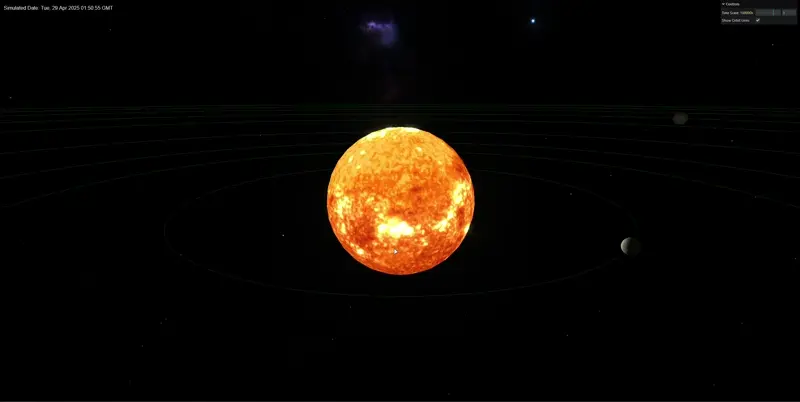

# Solar System Simulation

[Open scene in your browser](https://dev-kreg.github.io/threejs-solar-system/)

## Running the Project locally

1. Ensure you have Node.js installed on your system.
2. Clone this repository.
3. Navigate to the project directory in your terminal.
4. Run `npm install` to install dependencies.
5. Run `npm run dev` to start the development server.
6. Open your browser and go to `http://localhost:4200` (or the port specified in your console).

## Features

- Realistic orbital periods and rotations for each planet
- Interactive orbits and planet selection
- Detailed planet view with close-up 3D rendering and information
- Adjustable time scale
- Toggleable orbit lines
- Bloom effect for enhanced visuals

## Caveats

While this simulation aims to provide a representation of our solar system, it has some simplifications:

1. Planet textures are static and do not accurately represent the face pointing towards the sun at any given date.
2. Orbits are perfectly circular, whereas real planetary orbits are elliptical.
3. Planet sizes are to scale relative to each other, but the sun's size and inter-planetary distances are not to scale for better visualization.
4. The simulation does not account for gravitational interactions between planets or other celestial bodies.
5. No moons! 

## Controls

- Use the GUI in the top-right corner to adjust the time scale and toggle orbit lines.
- Click and drag to rotate the view, scroll to zoom in/out.
- Hover over planets or their orbits to highlight the orbit.
- Click on a planet or its orbit to open a detailed view, showing:
  - A close-up 3D view of the selected planet
  - Key information about the planet (name, radius, orbit radius, orbital period)
- The detail view follows the planet's position on the screen as it orbits.
- Use the close button on the detail view to return to the main solar system view.
