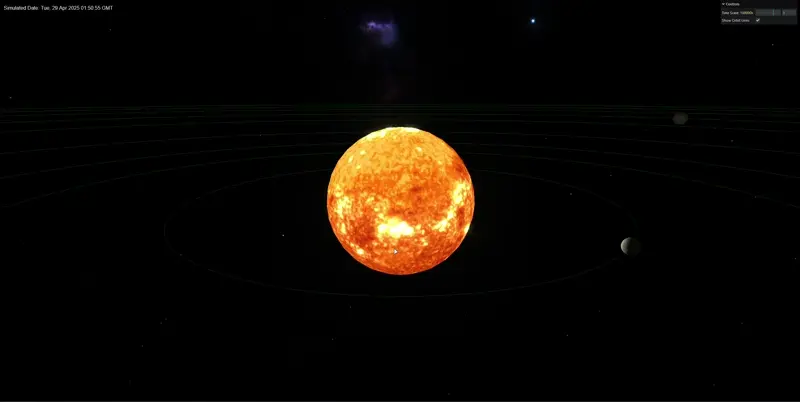

# Solar System Simulation

[Open scene in your browser](https://dev-kreg.github.io/threejs-solar-system/)

## Running the Project locally

1. Ensure you have Node.js installed on your system.
2. Clone this repository.
3. Navigate to the project directory in your terminal.
4. Run `npm install` to install dependencies.
5. Run `npm run dev` to start the development server.
6. Open your browser and go to `http://localhost:4200` (or the port specified in your console).

## Features

- Elliptical orbits with real inclinations, eccentricities, and Kepler-correct speeds (planets move faster near perihelion)
- Realistic orbital periods, rotations, and axial tilts for each planet
- Click a planet (or its label/orbit) to fly the camera in and follow it, with a draggable info panel
- Jump the simulation to any date with the date picker
- Adjustable time scale, toggleable orbit lines and name labels
- Compact-distance mode to bring the outer planets into view
- Mobile friendly: bottom-sheet info panel, tap-friendly labels
- Bloom effect for enhanced visuals

## Caveats

While this simulation aims to provide a representation of our solar system, it has some simplifications:

1. Planet textures are static and do not accurately represent the face pointing towards the sun at any given date.
2. Orbital phases are approximate: all planets are assumed to be at perihelion at the J2000 epoch.
3. Planet sizes are to scale relative to each other, but the sun's size and inter-planetary distances are not to scale for better visualization.
4. The simulation does not account for gravitational interactions between planets or other celestial bodies.
5. No moons! 

## Controls

- Click and drag to rotate the view, scroll to zoom in/out.
- Hover over planets or their orbits to highlight the orbit.
- Click a planet, its orbit, or its name label: the camera flies in and follows it, then an info panel with detailed data appears (drag it to reposition; scroll to take over the zoom).
- Close the panel to glide back to the sun-centered view at your previous zoom.
- Use the GUI in the top-right corner to adjust the time scale and toggle orbit lines, labels, and compact distances.
- Use the date picker in the bottom-left to jump the simulation to any date.
- Append `?debug` to the URL for an FPS counter.
